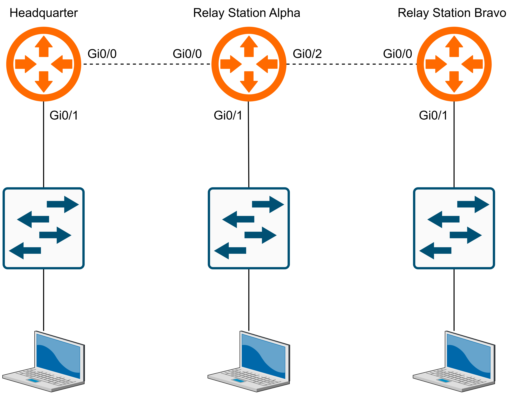

# 🛰️ Operation Outpost

  

## 📂 File Details  
- **Assigned Agent:** Mr. Green 🟢   
- **Status:** ACTIVE FIELD MISSION  
- **Threat Actor:** Enemy forces suspected of sabotage  

---

## 📜 Mission Briefing  
Agent Green 🟢, our communication grid has collapsed. The Headquarter is secure, but two relay stations—**Relay Station Alpha** and **Relay Station Bravo**—are offline.  

Enemy sabotage destroyed the communication cables and corrupted the routers at both stations. Without them, intelligence cannot flow, leaving the Agency blind.  

Your task: restore the network, rebuild the relay stations, and bring communications back online.

---

## 🗺️ Mission Topology  

  

---

## 🔐 Mission Tasks  

### Phase 1 — Relay Station Alpha  
- Connect the cable: **Headquarter Gi0/0 ↔ Relay Station Alpha Gi0/0**  
- Erase the old configs and reload the router.  
- Rebuild **Relay Station Alpha** with:  
  - Set hostname  
  - Assign IP addresses to all interfaces  
  - Configure static routes  
  - Create local user account  
  - Set enable secret for privileged mode  
  - Configure SSH v2 with domain name and RSA key  

### Phase 2 — Relay Station Bravo  
- Connect the cable: **Relay Station Alpha Gi0/1 ↔ Relay Station Bravo Gi0/0**  
- Erase the old configs and reload the router.  
- Rebuild **Relay Station Bravo** with:  
  - Set hostname  
  - Assign IP addresses to all interfaces  
  - Configure static routes  
  - Create local user account  
  - Set enable secret for privileged mode  
  - Configure SSH v2 with domain name and RSA key  

### Phase 3 — Final Checks  
- Ensure all configs are saved and devices are stable.  

---

## 📂 Mission Intel 

### 🌐 Headquarter

- **Interfaces:**
  - Gi0/0 → 16.0.0.1/30
  - Gi0/1 → 10.0.0.1/24

### 🌐 Relay Station Alpha  
- **Hostname:** Relay-Alpha 
- **Enable Secret:** `AlphaR00t!`   
- **Interfaces:**  
  - Gi0/0 → 16.0.0.2/30  
  - Gi0/1 → 15.0.0.1/30  
  - Gi0/2 → 192.168.1.1/24  
- **Static Routes:**  
  - `10.0.0.0/24 → 16.0.0.1`  
  - `192.168.2.0/24 → 15.0.0.2`  
- **🔒 Security (SSH v2):**  
  - Username: `agent_alpha`  
  - Secret: `A1ph@Net2025`  
  - Domain: `alpha.agency.lab`  
  - RSA Key: 1024 bits  

### 🌐 Relay Station Bravo  
- **Hostname:** Relay-Bravo  
- **Enable Secret:** `BravoR00t!`  
- **Interfaces:**  
  - Gi0/0 → 15.0.0.2/30  
  - Gi0/1 → 192.168.2.1/24  
- **Static Routes:**  
  - `10.0.0.0/24 → 15.0.0.1`  
  - `192.168.1.0/24 → 15.0.0.1`  
  - `16.0.0.0/30 → 15.0.0.1`  
- **🔒 Security (SSH v2):**  
  - Username: `agent_bravo`  
  - Secret: `Br@v0Net2025`  
  - Domain: `bravo.agency.lab`  
  - RSA Key: 1024 bits 

### 🖥️ Host Devices  
- **Mr Green:** `10.0.0.10/24`, GW: `10.0.0.1`  
- **Laptop1:** `192.168.1.10/24`, GW: `192.168.1.1`  
- **Laptop2:** `192.168.2.10/24`, GW: `192.168.2.1` 

*Note: Headquarter is already secure and configured. Use it only for verification.*  
 
---

## 🏆 Mission Success Criteria  
✔️ Relay Station Alpha fully rebuilt and operational  
✔️ Relay Station Bravo fully rebuilt and operational  

**Ping Tests**  
- Mr Green ↔ Relay Station Alpha  
- Mr Green ↔ Relay Station Bravo  
- Mr Green ↔ Laptop1  
- Mr Green ↔ Laptop2  
- Laptop1 ↔ Laptop2  

**SSH Tests**  
- SSH login to Relay Station Alpha (`192.168.1.1`)  
- SSH login to Relay Station Bravo (`192.168.2.1`)  

**Privilege Escalation**  
- `enable` access confirmed after SSH login  

✔️ All configs saved (wr)

---

## ⚠️ Directive — Rules of Engagement  
- Restore **Relay Station Alpha before Relay Station Bravo**  
- Use only static routes for connectivity  
- Do not configure VLANs or dynamic routing  
- Ensure SSH and enable secrets are active and secure on both Relay Stations  

---
